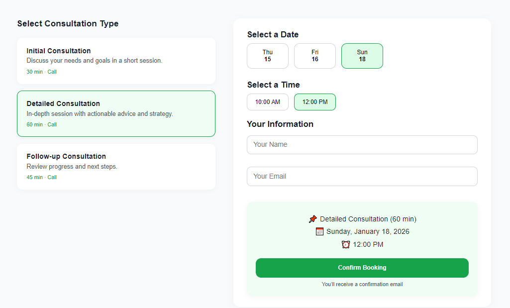

# 📅 Meeting System

### Online Meeting & Consultation Scheduling Platform

Meeting System is a web-based appointment scheduling platform designed to simplify the process of arranging meetings and consultations. The system allows users to view available time slots, book appointments, and choose between **online** and **in-person** meetings.

It also includes an **Admin Panel** for managing schedules, appointments, and available booking slots.

---

## ✨ Features

### 📅 Meeting Scheduling

Create and manage scheduled meetings by defining available dates and time slots.

### 🕒 Available Time Slots

Users can view available appointment slots and select a convenient date and time for their meeting.

### 💻 Online Appointments

Users can arrange meetings remotely by selecting the online meeting option.

### 🏢 In-Person Appointments

The system also supports physical appointments for users who prefer an in-person consultation.

### 📋 Consultation Booking

A dedicated booking flow allows users to request and schedule consultations based on available slots.

### 🛠️ Admin Panel

Administrators can manage the scheduling system, including available meeting slots and appointments.

### 📱 Responsive Interface

The system is designed with a clean and user-friendly interface for a smooth booking experience.

---

## 🔄 How It Works

The booking process follows a simple workflow:

```text
Admin Creates Availability
          ↓
Available Slots Become Visible
          ↓
User Opens Booking / Consultation Page
          ↓
Selects Date & Available Time
          ↓
Chooses Meeting Type
     ↙              ↘
Online          In-Person
     ↘              ↙
       Appointment
          ↓
       Scheduled
```

---

## 👨‍💼 Admin Panel

The administrative section provides control over the appointment scheduling system.

Administrators can manage:

* 📅 Meeting schedules
* 🕒 Available time slots
* 📋 Appointments
* 👥 Booking information
* 💻 Online appointment availability
* 🏢 In-person appointment availability

---

## 📖 Booking & Consultation

Users can access the booking interface to:

1. Select an available date
2. Choose an available time slot
3. Provide the required information
4. Select the meeting type
5. Schedule the appointment

The system helps prevent the need for manual coordination by presenting available slots directly to users.

---

## 🖥️ Interface Preview



> Replace `assets/meeting-system.png` with the actual filename of the screenshot you upload to the repository.

---

## 🛠️ Technologies

The project is organized around reusable frontend components and page-based application structure.

* HTML
* CSS
* JavaScript
* Web Components / Reusable Components
* Page-based frontend architecture

---

## 📂 Project Structure

```text
meeting-system/
│
├── assets/
│   └── ...
│
├── components/
│   └── ...
│
├── pages/
│   └── ...
│
├── .gitattributes
└── README.md
```

---

## 🎯 Project Purpose

The goal of this project is to provide a simple and organized solution for appointment scheduling.

Instead of coordinating meeting times manually, administrators can define availability while users can independently select an available slot and arrange their preferred type of appointment.

---

## 🔮 Possible Future Improvements

* 📧 Email confirmation notifications
* 🔔 Appointment reminders
* 📆 Calendar integration
* 🔗 Online meeting link generation
* 🔄 Rescheduling and cancellation
* 👤 User accounts and booking history
* 📊 Admin dashboard statistics
* 📱 Improved mobile experience
* 🌐 Time-zone support

---

## 👨‍💻 Developer

**Nahal Malik**

Software Engineer

GitHub: [@nahalmalik](https://github.com/nahalmalik)

---

## 📌 Project Details

| Detail            | Information                    |
| ----------------- | ------------------------------ |
| **Project Name**  | Meeting System                 |
| **Project Type**  | Appointment Scheduling System  |
| **Category**      | Meeting & Consultation Booking |
| **Platform**      | Web                            |
| **Meeting Types** | Online & In-Person             |
| **Main Users**    | Admin & Clients                |
| **Scheduling**    | Available Time Slots           |

---

⭐ If you find this project useful, consider giving the repository a star.
